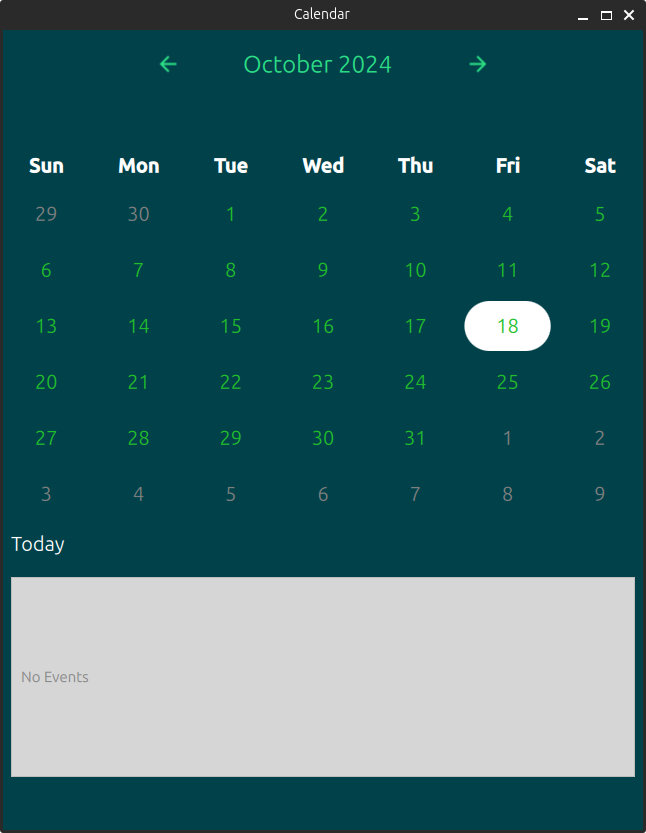

### Calendar w/ Qt 

A simple working example using ```MonthGrid``` to demonstrate a rather functional calendar example. Most of the information is found in the delegate

Design was inspired by Ubuntu's current implementation of the Calendar Widget in 24.04 




